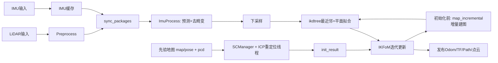
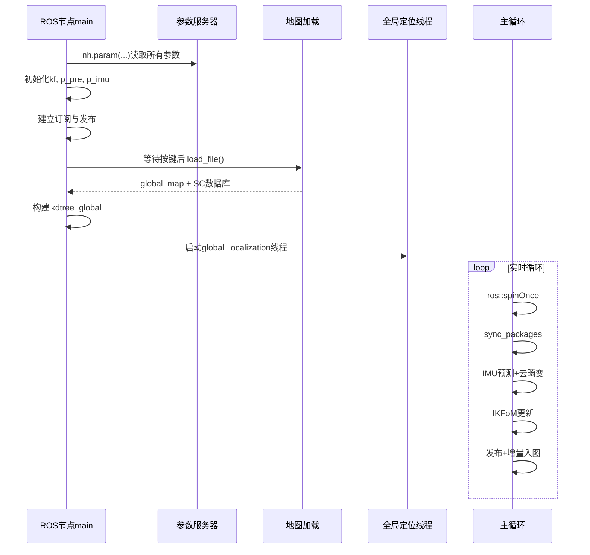
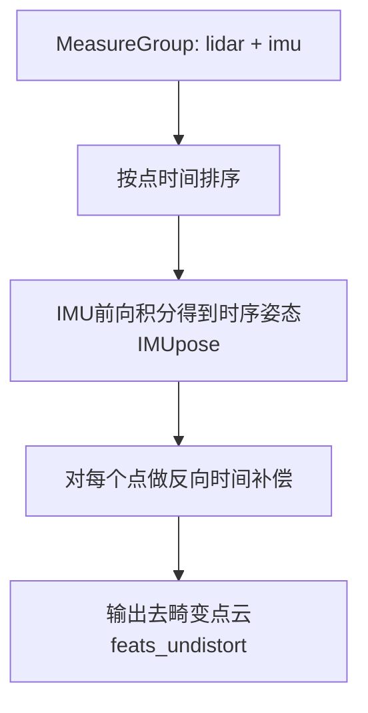
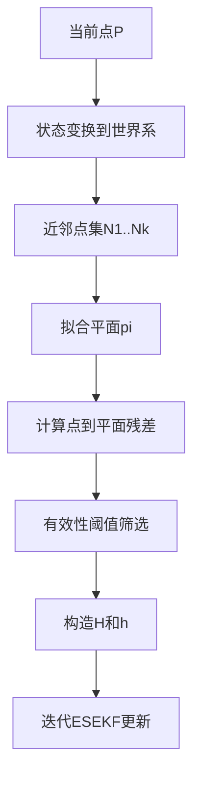
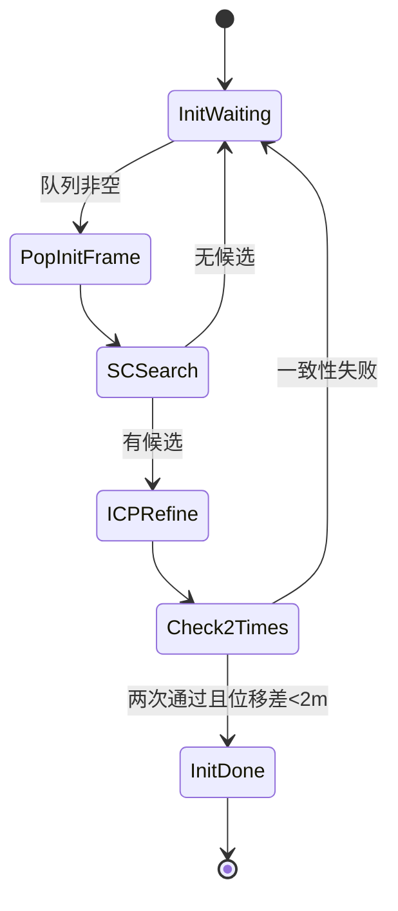
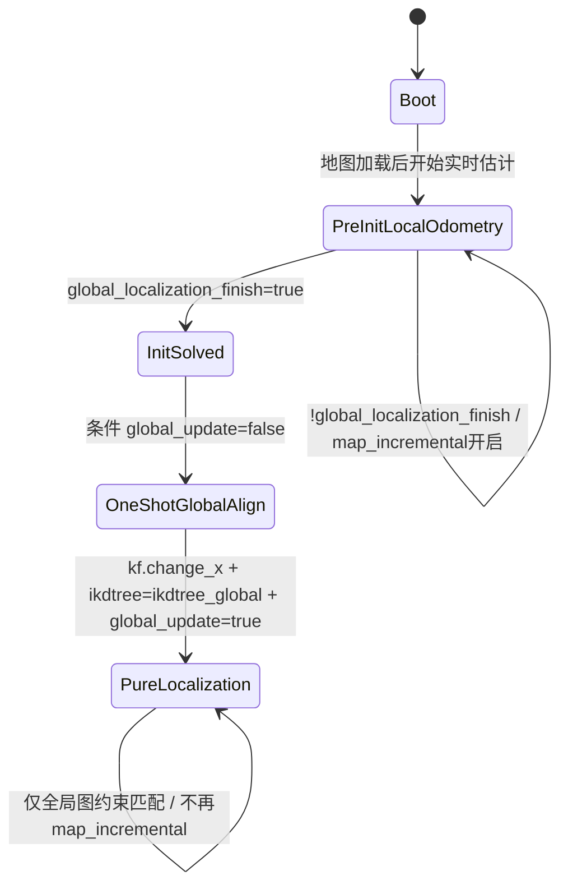
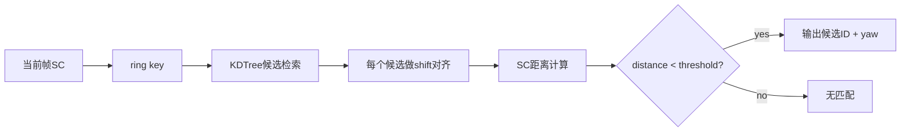
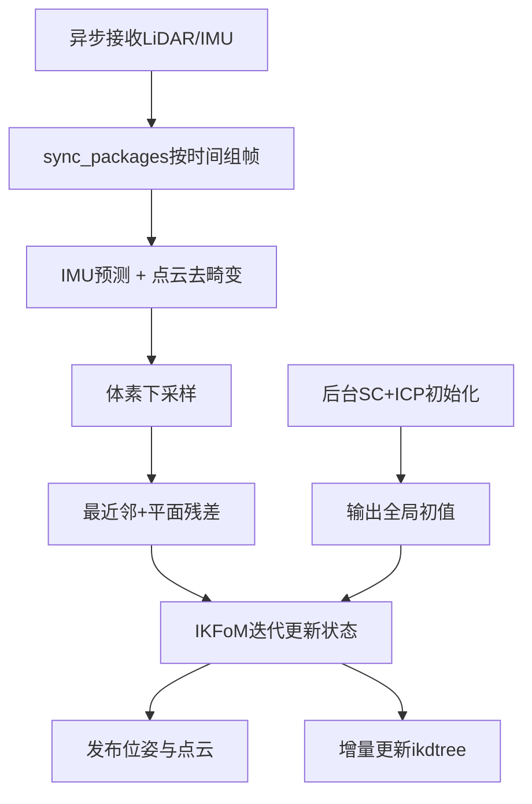

# FAST-LOCALIZATION 极致代码解读（架构 + 算法 + 线程 + 工程细节）

> 版本说明：本解读基于当前仓库源码（`src/laserMapping.cpp` 为核心），目标是帮助你做到“可读、可改、可调、可扩展”。

---

## 0. 一句话认知

`FAST-LOCALIZATION` 是一个 **FAST-LIO2 风格的 LiDAR-IMU 紧耦合定位系统**，在运行初期通过 **Scan Context + ICP** 自动完成全局初始化，随后把滤波状态对齐到先验地图坐标系，并在全局约束下持续输出高频里程计与点云。

---

## 1. 仓库地图（先知道每个文件在做什么）

### 1.1 主干文件

- `src/laserMapping.cpp`
  - 主节点入口、回调、同步组包、滤波更新、地图增量、重定位线程、发布逻辑都在这里。
- `src/IMU_Processing.hpp`
  - IMU 初始化、预测传播、点云去畸变（前向传播 + 反向补偿）。
- `src/preprocess.cpp` + `src/preprocess.h`
  - 多雷达数据接入（Livox/Ouster/Velodyne），统一点类型与时间字段，支持可选特征提取。
- `include/use-ikfom.hpp`
  - IKFoM 状态流形定义、系统方程 `f`、雅可比 `df/dx`、`df/dw`。
- `include/common_lib.h`
  - 公共类型、宏、拟合平面函数、距离函数、`MeasureGroup` 定义。
- `include/Scancontext/Scancontext.*`
  - Scan Context 描述子、ring key 树检索、旋转对齐与距离判定。
- `include/ikd-Tree/*`
  - 增量 KD-Tree 容器（核心近邻搜索与增量加点依赖）。

### 1.2 配置与启动

- `config/*.yaml`：传感器与噪声参数。
- `launch/*.launch`：加载参数并启动 `fast_localization` 节点。
- `msg/Pose6D.msg`：IMU-去畸变中间状态结构（时间、acc、gyr、vel、pos、rot）。

---

## 2. 总体系统图（先搭全局脑图）

---

## 3. 启动时发生了什么（main 函数分段拆解）

`src/laserMapping.cpp` 的 `main()` 可分 9 段：

1. **ROS 初始化与参数读取**
2. **滤波器与噪声初始化**
3. **日志与调试文件初始化**
4. **订阅/发布器创建**
5. **等待按键后加载先验地图**
6. **构建全局 ikdtree**
7. **启动全局定位线程**
8. **主循环：spin + sync + 预测更新 + 发布 + 增量建图**
9. **退出前保存 PCD / 关闭日志**

### 3.1 启动时序图

---

## 4. 数据结构级解剖（运行时“内脏图”）

### 4.1 输入缓冲

- `deque<PointCloudXYZI::Ptr> lidar_buffer`
- `deque<double> time_buffer`
- `deque<sensor_msgs::Imu::ConstPtr> imu_buffer`
- 互斥：`mutex mtx_buffer`

作用：把异步回调数据转成“可同步消费”的流。

### 4.2 核心状态

- `esekfom::esekf<state_ikfom, 12, input_ikfom> kf`
- `state_ikfom state_point`

`state_ikfom` 字段：

- 位置 `pos`
- 姿态 `rot`
- 外参 `offset_R_L_I`, `offset_T_L_I`
- 速度 `vel`
- 偏置 `bg`, `ba`
- 重力方向 `grav`（S2 流形）

### 4.3 地图容器

- `ikdtree`：当前实时匹配树
- `ikdtree_global`：先验全局地图树
- `global_map`：加载地图聚合点云

### 4.4 初始化协作区

- `queue<pair<int, PointCloudXYZI::Ptr>> init_feats_down_bodys`
- `position_init / pose_init`
- `position_map / pose_map`
- `init_result`
- 状态标志：`global_localization_finish`, `global_update`

---

## 5. LiDAR 输入链（从消息到可用点云）

### 5.1 回调分支

- Livox：`livox_pcl_cbk(const livox_ros_driver::CustomMsg::ConstPtr&)`
- 标准点云：`standard_pcl_cbk(const sensor_msgs::PointCloud2::ConstPtr&)`

共同工作：

1. 检查时间回退（回退则清空 lidar 缓冲）。
2. 调 `p_pre->process(...)` 生成统一点云。
3. 入队 `lidar_buffer/time_buffer`。

Livox 额外：

- 若开启 `time_sync_en`，可在运行中估计一次 LiDAR-IMU 时间差。

### 5.2 预处理器 `Preprocess`

输出统一为 `pcl::PointXYZINormal`，并复用：

- `curvature` 字段存“点时间偏移”（后续去畸变关键）

分传感器实现：

- `avia_handler`
- `oust64_handler`
- `velodyne_handler`

若 `feature_extract_enable=false`（默认）：

- 走抽样 + 盲区剔除，速度快。

若 `feature_extract_enable=true`：

- `give_feature/plane_judge/edge_jump_judge` 做线束几何分类，输出面点/角点。

---

## 6. IMU 输入链（从消息到预测与去畸变）

### 6.1 IMU 回调 `imu_cbk`

步骤：

1. 按 `time_offset_lidar_to_imu` 修正时间戳。
2. 如启用自动同步再叠加 `timediff_lidar_wrt_imu`。
3. 检查 IMU 时间回退（回退清缓冲）。
4. 入队 `imu_buffer`。

### 6.2 组包函数 `sync_packages`

输入：全局缓冲队列  
输出：`MeasureGroup`（一帧 LiDAR + 覆盖该帧区间的 IMU 序列）

关键点：

- LiDAR 帧尾时间通过最后点 `curvature` 估算。
- 必须等到 `last_timestamp_imu >= lidar_end_time` 才能输出可处理组包。

---

## 7. IMU 处理器 `ImuProcess` 深度解剖

### 7.1 初始化 `IMU_init`

核心目标：

- 估计静止期均值加速度与角速度。
- 从均值加速度推重力方向。
- 初始化 bias 与协方差矩阵。

初始化成功条件：

- `init_iter_num > MAX_INI_COUNT`

成功后：

- `imu_need_init_ = false`
- 使用配置的协方差尺度继续运行。

### 7.2 去畸变 `UndistortPcl`

两段算法：

1. **前向传播**
   - 在 IMU 序列上 `predict(dt, Q, in)`。
   - 记录每个 IMU 关键时刻 pose 到 `IMUpose`。
2. **反向补偿**
   - 按点时间从后往前，把每个点补偿到帧尾时刻坐标。

这使“扫描期间运动”得到消除，给后端匹配更稳定的几何输入。

### 7.3 去畸变算法图

---

## 8. 后端更新：点到平面约束 + IKFoM 迭代

### 8.1 主调用链

- `p_imu->Process(Measures, kf, feats_undistort)`
- 体素下采样 `downSizeFilterSurf`
- `kf.update_iterated_dyn_share_modified(...)`

### 8.2 观测模型构建函数 `h_share_model`

每个下采样点流程：

1. body -> world 变换
2. `ikdtree.Nearest_Search` 找 K 近邻
3. `esti_plane` 拟合局部平面
4. 点到平面残差筛选
5. 构造每点 Jacobian 到 `ekfom_data.h_x`
6. 残差写入 `ekfom_data.h`

### 8.3 约束几何图

### 8.4 `use-ikfom.hpp` 的动力学定义

- `get_f`：状态导数（速度、角速度、线加速度+重力）
- `df_dx`：状态雅可比（含重力流形项）
- `df_dw`：噪声雅可比（陀螺/加计/偏置噪声）

这保证了预测更新与观测更新在同一流形状态空间中闭环。

---

## 9. 地图维护：为什么点不会无限重复塞入

函数：`map_incremental()`

逻辑：

1. 把 `feats_down_body` 变换到 `feats_down_world`
2. 对每点取最近邻并按体素中心判定“是否值得加入”
3. 分成两类：
   - `PointToAdd`（需要正常下采样插入）
   - `PointNoNeedDownsample`（直接插入）
4. 调 `ikdtree.Add_Points(...)`

效果：

- 抑制同一局部区域重复加点，控制地图密度与查询效率。

---

## 10. 全局定位线程极致解析（初始化大脑）

函数：`global_localization()`

### 10.1 输入来源

仅在 `!global_localization_finish` 时，主线程不断推：

- 当前帧去畸变下采样点云 `feats_down_body`
- 该帧在“里程计坐标系”下估计位姿 `position_init/pose_init`

### 10.2 线程内完整流程

1. 从队列取一帧初始化点云。
2. 构建当前帧 Scan Context，检索全图候选 `localization_id + yaw`。
3. 若未匹配到候选（id=-1）则继续取下一帧。
4. 载入候选地图帧 pcd。
5. 两阶段 ICP：
   - 第一轮 `max_corr_dist=5`
   - 第二轮 `max_corr_dist=1`
6. 叠加 yaw 初始旋转 + ICP 校正得到 `T_corr`。
7. 与地图帧位姿 `T_or`、外参 `T_i_l` 合成全局初始化解 `T`。
8. 连续两次成功且平移差 < 2m 认为初始化稳定。

### 10.3 状态机

---

## 11. 主线程如何接管全局初始化结果

触发条件：

- `global_localization_finish && !global_update`

主线程执行一次性坐标对齐：

1. 取初始化时刻里程计位姿 `T_odom_init_time`
2. 取当前里程计位姿 `T_odom_current`
3. 取重定位给出的 `T_map_init_time`
4. 算 `T_map_current = T_map_init_time * inv(T_odom_init_time) * T_odom_current`
5. 把 `state_point.pos/rot` 替换为 `T_map_current`
6. `kf.change_x(global_state)` 写回滤波器
7. `ikdtree = std::move(ikdtree_global)` 切换全局地图约束
8. `global_update = true`，避免重复切换

这是系统从“局部里程计”跃迁到“全局定位”的关键瞬间。

---

## 11.5 纯定位模式（你最关心）- 代码级精读

这一节只讲“纯定位模式”真实行为，不讲泛化概念。

### A. 先说结论（基于当前代码）

当前仓库的“纯定位模式”并不是通过 `localization_mode` 参数切换出来的，而是由状态变量驱动：

- 初始化成功前：系统会临时做增量入图（用于稳定前端和初始化数据积累）。
- 初始化成功后：系统停止 `map_incremental()`，并把匹配地图切换为先验全局地图 `ikdtree_global`。
- 切换后：后端约束来源固定为全局地图树，行为上就是“纯定位（不再在线建图）”。

也就是说，**纯定位触发条件是 `global_localization_finish=true` 且主线程已执行 `global_update=true` 的那一刻**。

### B. 关键代码证据（逻辑链）

1) 参数读取处虽有 `localization_mode`，但主路径没有基于它做分支：

- `nh.param<int>("common/localization_mode", localization_mode, 1);`

2) 地图增量只在“未完成全局初始化”时执行：

- 主循环里是：
  - `if (!global_localization_finish) { map_incremental(); }`

3) 初始化完成后执行一次性全局接管：

- `if (global_localization_finish && !global_update) { ... }`
- 内部关键动作：
  - 计算 `T_map_current`
  - `kf.change_x(global_state)`
  - `ikdtree = std::move(ikdtree_global);`
  - `global_update = true;`

4) 因为第 2 点 + 第 3 点，后续帧不会再走增量建图，只会在全局树上做最近邻匹配与滤波更新。

### C. “纯定位模式”内部状态机（精确）

### D. 纯定位模式每帧到底做什么

进入 `PureLocalization` 后，主循环每帧仍做这些步骤（非常关键）：

1. `sync_packages` 组包  
2. `ImuProcess.Process`（预测 + 去畸变）  
3. 点云下采样  
4. `h_share_model` 在 `ikdtree(=global map)` 上找近邻并构建点到平面约束  
5. `kf.update_iterated_dyn_share_modified` 更新状态  
6. 发布 Odom/TF/点云/path  

唯一明显变化：

- **不再 map_incremental**（地图固定）
- **约束参考从“初始化期临时图”变为“先验全局图”**

### E. 这意味着什么（工程后果）

优点：

- 全局一致性更强，不会因在线建图漂移而逐步偏离先验地图。
- 资源开销更可控（少了持续增量建图与地图膨胀）。

代价：

- 对先验地图质量、时间同步、外参精度更敏感。
- 若环境变化大（动态物体、结构变化）会直接体现在残差上，可能出现抖动。

### F. 纯定位模式下的关键风险点（排障优先）

1. **初始化误对齐风险**  
   若 `init_result` 偏差大，后续会被“强行锁在错误全局系”。

2. **全局树不可用风险**  
   若 `load_file` 的地图坐标系不一致或 `pose.json` 对应错误，纯定位会持续劣化。

3. **时间偏移风险**  
   纯定位不再靠在线建图“缓冲误差”，时间错配会更明显暴露。

4. **外参误差风险**  
   `offset_R_L_I/offset_T_L_I` 不准会导致去畸变和几何约束都偏。

### G. 纯定位模式观测建议（你可以直接查）

建议重点盯这些运行信号：

- 日志中是否出现 `Global localization successfully`
- 该日志后是否只出现稳定的 odom 更新（无大跳）
- `runtime_pos_log_enable` 打开后关注：
  - `ave match`
  - `ave solve`
  - 总耗时与有效点数量

如果初始化后残差长期偏高且轨迹抖：

- 先查时间偏移，再查外参，再查地图坐标一致性。

### H. 你可能会问：`localization_mode` 现在有什么用？

从当前实现看，它被读取但几乎没进入主流程分支。  
因此如果你要“显式纯定位开关”，建议二开时做：

- `localization_mode=PURE_LOCALIZATION`：
  - 初始化前也禁用 `map_incremental`
  - 或仅保留极短暂 warmup 帧
- 并新增状态 topic，明确显示当前处于：
  - PreInit / Aligning / PureLocalization

---

## 12. Scan Context 子模块（算法视角）

### 12.1 描述子生成

- 极坐标网格 `PC_NUM_RING x PC_NUM_SECTOR`（默认 20x60）
- 每格取最大 z 值，得到 `desc`
- 生成两种 key：
  - `ring key`：行均值（旋转不变）
  - `sector key`：列均值（旋转相关）

### 12.2 检索步骤

1. ring key 进 KD-Tree，找若干候选。
2. 对候选做列循环平移对齐（找 yaw）。
3. 计算 SC 距离（列余弦相似度）。
4. 小于阈值判定有效重定位候选。

### 12.3 检索流程图

---

## 13. 坐标系与TF语义（非常关键）

发布坐标：

- `odomAftMapped.header.frame_id = "camera_init"`
- `odomAftMapped.child_frame_id = "body"`

TF 发布：

- `camera_init -> body`

在本工程里：

- 启动后到全局初始化成功前，`camera_init` 更接近里程计世界。
- 对齐后，`camera_init` 实质被拉到地图一致坐标。

---

## 14. 参数分组与“调参优先级”

### 14.1 高优先级（先调这些）

- `mapping/gyr_cov`, `mapping/acc_cov`
- `mapping/b_gyr_cov`, `mapping/b_acc_cov`
- `filter_size_surf`, `filter_size_map`
- `point_filter_num`
- `preprocess/blind`
- `mapping/extrinsic_*`（若外参未精准标定影响会非常大）

### 14.2 时间相关

- `common/time_offset_lidar_to_imu`
- `common/time_sync_en`

时间错配会直接表现为：

- 去畸变效果差
- 轨迹抖动、残差增大、初始化不稳定

### 14.3 初始化相关

- SC 阈值在 `Scancontext.h` 内部常量（非yaml），若要改需改代码。
- ICP 阈值在 `global_localization()` 中固定为 5m + 1m 两阶段。

---

## 15. 发布接口与用途

### 15.1 Topics

- `/Odometry`：核心定位输出
- `/path`：路径轨迹（`path_en` 控制）
- `/cloud_registered`：世界系点云
- `/cloud_registered_body`：机体系点云
- `/global_map`：加载地图时发布的全局地图分块
- `/Laser_map`、`/cloud_effected`：代码中存在发布函数，但主循环默认未打开

### 15.2 离线输出

- `Log/pos_log.txt`
- `Log/fast_lio_time_log.csv`（启用 runtime log 时）
- `PCD/scans*.pcd`（开启 pcd 保存）

---

## 16. 线程与锁（并发正确性角度）

### 16.1 锁对象

- `mtx_buffer`：保护 LiDAR/IMU 缓冲
- `init_feats_down_body_mutex`：保护初始化帧队列
- `global_localization_finish_state_mutex`：保护初始化状态标志

### 16.2 并发交互核心

- 回调线程负责“喂数据”
- 主线程负责“消费、估计、发布”
- 重定位线程负责“初始化求全局解”

潜在风险点（工程改造时注意）：

- 初始化队列存指针，若复用对象生命周期管理不严谨可能出现共享数据意外修改。
- `global_localization_thread` 的退出条件依赖 `ros::ok`，应确保节点退出时可自然收敛。

---

## 17. 精度与鲁棒性的关键影响因素

从代码实现可推断，影响排序大致如下：

1. **时间同步准确性**
2. **外参准确性**
3. **IMU噪声参数与真实传感器一致性**
4. **点云下采样与盲区参数**
5. **先验地图质量与Scan Context可区分性**

---

## 18. 你最关心的“可改造点”清单

### 18.1 可立即工程化改造

- 去掉 `getchar()`，改成参数化 `auto_load_map=true`。
- 把 SC/ICP 阈值挪到 YAML。
- 发布一个初始化状态 topic（未初始化/初始化中/已初始化）。
- 将全局定位成功判据从“仅平移差<2m”扩展到“平移+旋转+ICP fitness”。

### 18.2 可提升性能/稳定的改造

- 按距离或视野管理初始化队列长度，避免堆积。
- 对 `init_feats_down_bodys` 加去重策略（同姿态附近帧不反复送检）。
- 在初始化完成后保留低频 SC 复检，用于异常漂移检测与重锚定。

### 18.3 算法升级方向

- Scan Context 候选后增加 NDT 作为 ICP 备选。
- 建图部分引入局部地图滑窗（恢复并完善 `lasermap_fov_segment` 策略）。
- 结合回环图优化（当前是滤波为主，不是全局图优化架构）。

---

## 19. 逐函数索引（读源码时可直接跳）

### 19.1 `laserMapping.cpp`

- 回调与同步：
  - `standard_pcl_cbk`
  - `livox_pcl_cbk`
  - `imu_cbk`
  - `sync_packages`
- 几何变换与发布：
  - `pointBodyToWorld*`
  - `publish_frame_world`
  - `publish_frame_body`
  - `publish_odometry`
  - `publish_path`
- 地图与观测：
  - `map_incremental`
  - `h_share_model`
- 全局初始化：
  - `load_file`
  - `global_localization`
- 入口：
  - `main`

### 19.2 `IMU_Processing.hpp`

- `IMU_init`
- `UndistortPcl`
- `Process`

### 19.3 `preprocess.cpp`

- `process(...)`（多态入口）
- `avia_handler / oust64_handler / velodyne_handler`
- `give_feature / plane_judge / edge_jump_judge`

---

## 20. 一张“全流程极简记忆图”

---

## 21. 结论（给维护者的落地建议）

- 这个项目主干思路非常清晰：**局部紧耦合估计 + 启动阶段自动全局锚定**。
- 你如果要“长期维护”，优先把 **参数外置化 + 初始化状态可观测化 + 启动自动化** 做完。
- 你如果要“性能极限”，重点盯 **时间同步、外参、下采样策略、初始化候选质量**。
- 你如果要“产品化稳定”，建议补齐 **初始化失败重试策略、运行中异常重定位、线程退出与资源回收规范**。

---

## 22. 附：坐标与状态的最小数学表达（便于二次开发）

设状态为：

\[
x = [p, R, R_{LI}, t_{LI}, v, b_g, b_a, g]
\]

过程模型（简化）：

\[
\dot p = v,\quad
\dot R = R(\omega - b_g),\quad
\dot v = R(a - b_a) + g
\]

观测模型（点到平面）：

\[
r_i = n_i^\top (T(x)\,p_i) + d_i
\]

通过 `h_share_model` 将所有有效点残差拼成：

\[
r = H\delta x + \epsilon
\]

再由 IKFoM 迭代更新求解 \(\delta x\) 并回灌状态。

---

如果你愿意，我下一步可以继续给你做“**逐行级**”版本：  
把 `laserMapping.cpp` 按函数切成小节，给每个函数补上：

- 输入前置条件
- 输出副作用（改了哪些全局变量）
- 线程安全边界
- 调参敏感项
- 常见故障征兆与排查命令

---

## 23. 纯定位模式逐函数副作用表（极致版）

这一章只关注“纯定位模式相关链路”，并且偏工程排障视角。  
格式统一为：**输入前提 / 关键输出 / 改动全局状态 / 线程边界 / 故障征兆 / 快速排查**。

### 23.1 `sync_packages(MeasureGroup &meas)`

**输入前提**

- `lidar_buffer` 与 `imu_buffer` 中至少各有一份数据。
- LiDAR 点云中 `curvature` 已正确表达点内时序（来自 `Preprocess`）。

**关键输出**

- 成功时返回 `true`，并填充：
  - `meas.lidar`
  - `meas.lidar_beg_time`
  - `meas.lidar_end_time`
  - `meas.imu`（覆盖该帧时域的 IMU 序列）

**改动全局状态**

- `lidar_pushed`
- `lidar_end_time`
- 弹出 `lidar_buffer/time_buffer/imu_buffer` 已消费数据
- 更新 `lidar_mean_scantime` / `scan_num`（统计）

**线程边界**

- 由主循环调用；读写的是回调线程填充的共享队列（调用方需确保锁语义一致）。

**故障征兆**

- 主循环长期拿不到 `true`（系统“卡住但不报错”）。
- 高频出现 “Too few input point cloud!”。

**快速排查**

- 查 LiDAR 时间戳是否递增。
- 查 IMU 频率是否足够覆盖 LiDAR 帧尾时间。
- 查点云 `curvature` 的时间单位是否正确（特别是 Ouster/Velodyne）。

---

### 23.2 `ImuProcess::Process(...)`

**输入前提**

- `meas.imu` 不为空。
- `meas.lidar` 非空。

**关键输出**

- 初始化阶段：更新重力/bias/协方差，尚不进入稳定估计。
- 正常阶段：输出去畸变点云到 `cur_pcl_un_`，并更新滤波预测状态。

**改动全局状态（通过引用对象）**

- `kf_state`（预测后状态）
- `last_imu_`、`last_lidar_end_time_`
- 初始化标志 `imu_need_init_`

**线程边界**

- 仅主循环调用，无跨线程写同一实例。

**故障征兆**

- 初始化一直不结束（`IMU Initial Done` 不出现）。
- 去畸变后点云畸变仍明显（运动拖影）。

**快速排查**

- 检查 IMU 是否有合理静止段用于初始化。
- 检查 `time_offset_lidar_to_imu` 与 `time_sync_en` 是否叠加错误。
- 检查外参 `extrinsic_T/R` 是否接近真实安装值。

---

### 23.3 `h_share_model(state_ikfom &s, dyn_share_datastruct &ekfom_data)`

**输入前提**

- `feats_down_body` 已生成且非空。
- `ikdtree` 已有效构建（纯定位阶段应是 `ikdtree_global`）。

**关键输出**

- 构建观测雅可比 `h_x` 与残差向量 `h`。
- 给出有效特征数 `effct_feat_num` 与均值残差 `res_mean_last`。

**改动全局状态**

- `laserCloudOri`、`corr_normvect`、`normvec`
- `point_selected_surf[]`
- `effct_feat_num`、`total_residual`、`res_mean_last`
- 计时统计量 `match_time`、`solve_time`

**线程边界**

- 主循环调用；内部含 OpenMP 并行段（共享数组写入按索引位隔离）。

**故障征兆**

- 频繁 “No Effective Points!”。
- 定位输出出现抖动或突跳。

**快速排查**

- 先看地图与实时点云是否在同一坐标系（初始化是否正确）。
- 再看下采样过强导致特征不足（`filter_size_surf` 过大）。
- 再看外参和时间偏移，二者都会恶化残差筛选。

---

### 23.4 `map_incremental()`

> 纯定位模式里，这个函数是“应该停止”的对象。

**输入前提**

- 仅在 `!global_localization_finish` 阶段主循环调用。

**关键输出**

- 将当前帧候选点增量加入 `ikdtree`。

**改动全局状态**

- `ikdtree` 内容
- `add_point_size`、`kdtree_incremental_time`

**线程边界**

- 主线程调用；部分段落被 `init_feats_down_body_mutex` 保护。

**故障征兆（纯定位视角）**

- 如果你期望“严格纯定位”，但发现地图点数持续增长，说明流程仍在初始化前阶段或逻辑被改动。

**快速排查**

- 检查 `global_localization_finish` 是否已置真。
- 检查是否进入了 `global_update` 一次性切换块。

---

### 23.5 `global_localization()`

**输入前提**

- `load_file()` 已加载地图与 SC 数据库。
- 初始化队列 `init_feats_down_bodys` 持续收到主线程帧。

**关键输出**

- 成功时写入：
  - `global_localization_finish=true`
  - `init_result = {init_id, T_map_init_time}`

**改动全局状态**

- `global_localization_finish`
- `init_result`
- 清空 `init_feats_down_bodys`（成功后）

**线程边界**

- 独立后台线程，和主线程共享状态，通过 `global_localization_finish_state_mutex` 同步关键标志。

**故障征兆**

- 长时间无法初始化成功（没有 `Global localization successfully`）。
- 出现成功日志但后续轨迹大跳。

**快速排查**

- 检查 `map/pose.json` 与 `map/pcd/*.pcd` 是否一一对应。
- 检查 SC 候选是否经常 `-1`（场景可区分性不足或参数不匹配）。
- 检查 ICP 两阶段是否收敛（可打印 fitness）。

---

### 23.6 主循环中的“纯定位切换块”

对应逻辑：

- `if (global_localization_finish && !global_update) { ... }`

**输入前提**

- 后台线程已给出可靠 `init_result`。
- `position_init/pose_init` 存在 `init_id` 对应项。

**关键输出**

- 把当前滤波状态从里程计系映射到地图系。
- `ikdtree` 切换到全局地图树。
- 设置 `global_update=true`，保证只执行一次。

**改动全局状态**

- `state_point`
- `kf` 内部状态
- `ikdtree`（被 move 成 `ikdtree_global`）
- `global_update`

**线程边界**

- 主线程执行，但读取后台线程写入数据；由 `global_localization_finish_state_mutex` 保护状态标志。

**故障征兆**

- 切换瞬间出现位姿突跳过大。
- 切换后 residual 明显升高且长期不恢复。

**快速排查**

- 核对 `init_id` 对应的 `position_init/pose_init` 是否索引一致。
- 打印 `T_map_init_time`、`T_odom_init_time`、`T_map_current` 做矩阵 sanity check。
- 检查地图坐标定义是否和在线数据坐标定义一致（轴向、原点、单位）。

---

### 23.7 `publish_odometry(...)`（纯定位阶段观测窗口）

**输入前提**

- `state_point` 已经是当前帧更新后的状态。

**关键输出**

- 发布 `/Odometry` 与 TF `camera_init -> body`。

**改动全局状态**

- `odomAftMapped` 消息内容（含协方差填充）。

**线程边界**

- 主线程发布。

**故障征兆**

- TF 抖动或间歇性跳变。

**快速排查**

- 对比 `/Odometry` 与点云注册结果是否一致。
- 若轨迹平滑但点云错位，多半是外参/时间问题；若轨迹自身跳，先看初始化接管质量。

---

## 24. 纯定位模式“最小排障剧本”（建议照顺序）

### Step 1：确认是否真的进入纯定位

- 必须看到初始化成功日志。
- 并确认已完成一次性接管（`global_update=true`，且不再调用 `map_incremental`）。

### Step 2：确认地图坐标一致性

- 检查 `pose.json` 与 `pcd` 的坐标系定义一致。
- 检查地图是否与当前传感器安装方向一致（尤其 z 轴朝向、单位米制）。

### Step 3：确认时间与外参

- 优先检查 `time_offset_lidar_to_imu`。
- 再检查 `extrinsic_T/R`。

### Step 4：看残差与有效点

- 若 `No Effective Points` 频繁出现：先减小下采样体素，再检查地图稠密度与环境变化。

### Step 5：再做算法层优化

- 需要时扩展初始化成功判据（加入旋转差和 ICP fitness）。
- 必要时引入运行中低频重锚定机制。

